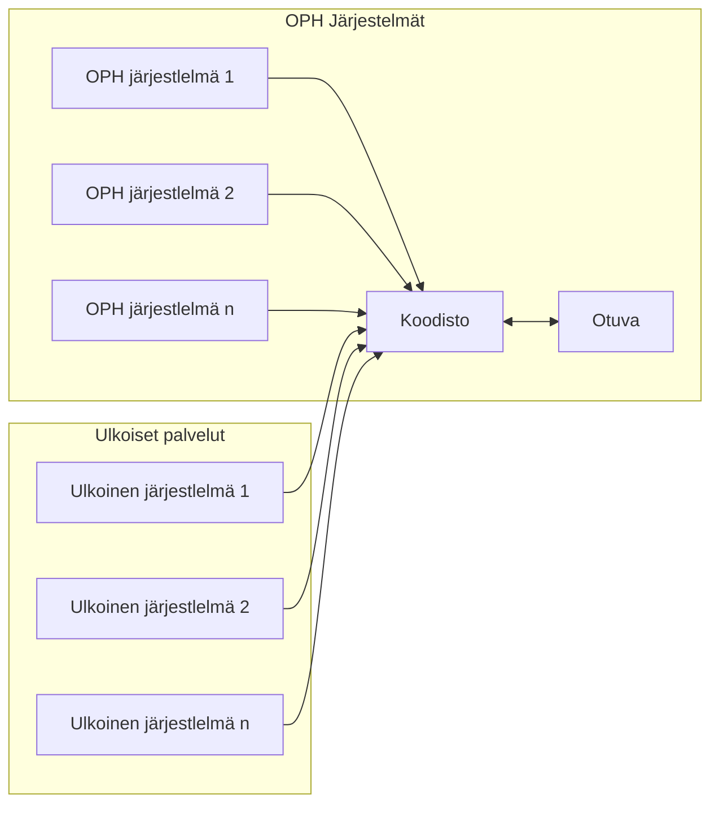

# Integraatiot

```mermaid


flowchart LR
    subgraph OPH Järjestelmät
        Koodisto
        Otuva
        muut_jarjestelmat_1[OPH järjestlelmä 1]
        muut_jarjestelmat_2[OPH järjestlelmä 2]
        muut_jarjestelmat_n[OPH järjestlelmä n]
    end
    subgraph Ulkoiset palvelut
        ulkoiset_jarjestelmat_1[Ulkoinen järjestlelmä 1]
        ulkoiset_jarjestelmat_2[Ulkoinen järjestlelmä 2]
        ulkoiset_jarjestelmat_n[Ulkoinen järjestlelmä n]
    end
    Koodisto <--> Otuva
    muut_jarjestelmat_1 --> Koodisto
    muut_jarjestelmat_2 --> Koodisto
    muut_jarjestelmat_n --> Koodisto
    ulkoiset_jarjestelmat_1 --> Koodisto
    ulkoiset_jarjestelmat_2 --> Koodisto
    ulkoiset_jarjestelmat_n --> Koodisto
```